# NE-NETRA System Architecture

**Version 2.0 - UX Enhanced Edition**

Technical architecture documentation for the NE-NETRA Early Warning Platform.

## Recent Updates (v2.0)

- ✅ **Export Functionality** - PDF/CSV export utilities for reports and audit logs
- ✅ **Fixed Number Formatting** - Clean rounded values across all displays
- ✅ **Fixed Layer Scaling Bug** - Proper 0-10 normalization with bounds checking
- ✅ **Enhanced Loading States** - Skeleton loaders for smooth UX
- ✅ **Updated Component Structure** - Page-based architecture with shared components
- ✅ **Risk History API** - 24-hour trend data for charts and exports

## High-Level Architecture

```
┌─────────────────────────────────────────────────────────────────┐
│                     USER LAYER                                  │
│  District Magistrate │ Superintendent of Police │ Admin         │
└──────────────────────┬──────────────────────────────────────────┘
                       │
                       │ HTTPS (Port 443)
                       ▼
┌─────────────────────────────────────────────────────────────────┐
│                  PRESENTATION LAYER                              │
│  ┌──────────────────────────────────────────────────────────┐  │
│  │             React Frontend (SPA)                         │  │
│  │  - Dashboard Components                                  │  │
│  │  - Real-time Updates                                     │  │
│  │  - Responsive Design (1440px desktop)                    │  │
│  │  - Material-UI + Custom Components                       │  │
│  └──────────────────────────────────────────────────────────┘  │
└──────────────────────┬──────────────────────────────────────────┘
                       │
                       │ REST API (JSON)
                       ▼
┌─────────────────────────────────────────────────────────────────┐
│                   APPLICATION LAYER                              │
│  ┌──────────────────────────────────────────────────────────┐  │
│  │           FastAPI Backend Server                         │  │
│  │  ┌────────────────────────────────────────────────────┐  │  │
│  │  │  API Endpoints:                                    │  │  │
│  │  │  - /ingest (POST)    - Data ingestion             │  │  │
│  │  │  - /analyze (POST)   - Trigger analysis           │  │  │
│  │  │  - /risk-score (GET) - Get risk assessment        │  │  │
│  │  │  - /review (POST)    - Submit officer review      │  │  │
│  │  │  - /audit-log (GET)  - Retrieve audit trail       │  │  │
│  │  └────────────────────────────────────────────────────┘  │  │
│  └──────────────────────────────────────────────────────────┘  │
└──────────────────────┬──────────────────────────────────────────┘
                       │
                       │
                       ▼
┌─────────────────────────────────────────────────────────────────┐
│                   INTELLIGENCE LAYER                             │
│  ┌──────────────────────────────────────────────────────────┐  │
│  │           AI Intelligence Engine                         │  │
│  │  ┌─────────────┐ ┌─────────────┐ ┌─────────────┐       │  │
│  │  │  Sentiment  │ │  Toxicity   │ │  Velocity   │       │  │
│  │  │  Analysis   │ │  Scoring    │ │  Calculator │       │  │
│  │  └─────────────┘ └─────────────┘ └─────────────┘       │  │
│  │         │               │               │               │  │
│  │         └───────────────┴───────────────┘               │  │
│  │                      │                                  │  │
│  │           ┌──────────▼──────────┐                       │  │
│  │           │ Composite Risk Score│                       │  │
│  │           │   (0-100 Scale)     │                       │  │
│  │           │ ┌─────────────────┐ │                       │  │
│  │           │ │ Weighted Formula│ │                       │  │
│  │           │ │ Sentiment: 25%  │ │                       │  │
│  │           │ │ Toxicity:  35%  │ │                       │  │
│  │           │ │ Velocity:  25%  │ │                       │  │
│  │           │ │ Geo-Sens:  15%  │ │                       │  │
│  │           │ └─────────────────┘ │                       │  │
│  │           └─────────────────────┘                       │  │
│  │                      │                                  │  │
│  │         ┌────────────▼────────────┐                     │  │
│  │         │  Explainability Engine  │                     │  │
│  │         │  - Primary Trigger ID   │                     │  │
│  │         │  - Contributing Factors │                     │  │
│  │         │  - Trend Detection      │                     │  │
│  │         └─────────────────────────┘                     │  │
│  └──────────────────────────────────────────────────────────┘  │
└──────────────────────┬──────────────────────────────────────────┘
                       │
                       │ SQLAlchemy ORM
                       ▼
┌─────────────────────────────────────────────────────────────────┐
│                      DATA LAYER                                  │
│  ┌──────────────────────────────────────────────────────────┐  │
│  │        SQLite Database (Prototype)                       │  │
│  │        PostgreSQL (Production)                           │  │
│  │                                                          │  │
│  │  ┌────────────┐  ┌────────────┐  ┌────────────┐        │  │
│  │  │  messages  │  │risk_scores │  │officer_    │        │  │
│  │  │            │  │            │  │reviews     │        │  │
│  │  │ district   │  │ district   │  │ district   │        │  │
│  │  │ text       │  │ score      │  │ officer_id │        │  │
│  │  │ timestamp  │  │ risk_level │  │ notes      │        │  │
│  │  │ geo_type   │  │ trend      │  │ reviewed   │        │  │
│  │  │ sentiment  │  │ components │  │ timestamp  │        │  │
│  │  │ toxicity   │  │ trigger    │  │            │        │  │
│  │  └────────────┘  └────────────┘  └────────────┘        │  │
│  │                                                          │  │
│  │  ┌────────────┐                                         │  │
│  │  │audit_logs  │                                         │  │
│  │  │            │                                         │  │
│  │  │ district   │                                         │  │
│  │  │ officer    │                                         │  │
│  │  │ action     │                                         │  │
│  │  │ timestamp  │                                         │  │
│  │  │ metadata   │                                         │  │
│  │  └────────────┘                                         │  │
│  └──────────────────────────────────────────────────────────┘  │
└─────────────────────────────────────────────────────────────────┘
```

## Component Details

### 1. Frontend (React + TypeScript + Vite)

**Location**: `/src/app/`

**Page Components** (`/src/app/pages/`):
- `DashboardPage.tsx` - Risk overview with map and statistics
- `RiskAnalysisPage.tsx` - Detailed breakdown with export buttons
- `ActionsPage.tsx` - AI-generated suggested actions
- `ReviewPage.tsx` - Officer review form
- `AuditPage.tsx` - Transparency and audit trail
- `IngestPage.tsx` - Data ingestion interface

**Shared Components** (`/src/app/components/`):
- `dashboard-header.tsx` - District selector with searchable combobox
- `risk-score-card.tsx` - Composite score display (0-100, rounded)
- `risk-explanation-panel.tsx` - Primary trigger + contributing factors
- `risk-map.tsx` - Interactive map with H3 hexagonal grid
- `charts/RiskTrendChart.tsx` - 24-hour risk trend visualization
- `ui/` - Reusable UI primitives (Button, Card, Skeleton, etc.)

**Utilities** (`/src/app/utils/`):
- `export.ts` - PDF/CSV export functionality
  - `exportRiskAnalysisPDF()` - Generates professional PDF reports
  - `exportAuditLogCSV()` - Exports audit logs as CSV
  - `exportRiskHistoryCSV()` - Exports trend data as CSV

**Design System**: `/src/styles/index.css`
- Dark theme (#0a0f1a background)
- Severity colors (green/amber/red/critical)
- WCAG AA compliant contrast
- Modern glassmorphism effects

**State Management**: React Router + hooks (useState, useEffect)

**API Client**: `/src/app/services/api.ts`
- Type-safe API calls with TypeScript interfaces
- Error handling and retry logic
- Response validation with Zod/Pydantic schemas

### 2. Backend (FastAPI)

**Location**: `/backend/`

**Core Files**:
- `main.py` - FastAPI application with all endpoints
- `database.py` - SQLAlchemy models and session management
- `models.py` - Pydantic request/response schemas
- `intelligence.py` - AI logic and risk scoring

**Endpoints**:

| Endpoint | Method | Purpose | Auth Required |
|----------|--------|---------|---------------|
| `/` | GET | Health check | No |
| `/ingest` | POST | Ingest message | Yes (production) |
| `/analyze` | POST | Run analysis | Yes |
| `/risk-score/{district}` | GET | Get latest risk score with layers | Yes |
| `/risk-history/{district}` | GET | Get 24-hour risk trend data | Yes |
| `/review` | POST | Submit officer review | Yes |
| `/audit-log/{district}` | GET | Get audit trail | Yes |
| `/districts` | GET | List all districts | No |
| `/stats/{district}` | GET | Get district statistics | No |

**New in v2.0**: `/risk-history/{district}` endpoint provides historical risk scores for trend analysis and CSV exports.

**Middleware**:
- CORS (configured for frontend domain)
- Request validation (Pydantic)
- Error handling
- (Production: Authentication, Rate limiting, Logging)

### 3. Intelligence Engine

**Location**: `/backend/intelligence.py`

**Class**: `RiskIntelligence`

**Methods**:

#### `analyze_sentiment(text: str) -> float`
Returns: -1.0 (very negative) to +1.0 (very positive)

**Algorithm**:
```python
positive_count = count(positive_keywords in text)
negative_count = count(negative_keywords in text)
sentiment = (positive_count - negative_count) / (positive_count + negative_count)
```

**Keywords**:
- Positive: "good", "great", "success", "peace", "harmony"
- Negative: "bad", "terrible", "crisis", "injustice", "fail"

#### `analyze_toxicity(text: str) -> float`
Returns: 0.0 (not toxic) to 1.0 (highly toxic)

**Algorithm**:
```python
high_toxic = count(high_toxicity_keywords) × 1.0
medium_toxic = count(medium_toxicity_keywords) × 0.5
low_toxic = count(low_toxicity_keywords) × 0.2

if escalation_pattern_detected:
    toxicity_score *= 1.5

toxicity_score = min(1.0, toxicity_score / 10.0)
```

**Keywords**:
- High: "attack", "kill", "destroy", "burn", "riot", "violence", "bomb"
- Medium: "protest", "clash", "conflict", "tension", "anger"
- Low: "concern", "worry", "issue", "problem"

**Escalation Patterns** (regex):
- `\b(tomorrow|tonight|today)\s+(we|let's|time to)\b`
- `\bgather\s+(at|near|in)\b`
- `\bspread\s+(this|message|word)\b`

#### `calculate_velocity(messages, time_window_hours=24) -> (float, int)`
Returns: (velocity_score, message_count)

**Algorithm**:
```python
recent_messages = messages in last N hours
messages_per_hour = len(recent_messages) / N
velocity_score = min(1.0, messages_per_hour / 10.0)
```

Baseline: 10+ messages/hour = very high velocity

#### `calculate_geo_sensitivity(geo_type: str) -> float`
Returns: 0.0 to 1.0

**Weights**:
- Sensitive Zone: 1.0
- Market: 0.8
- Highway: 0.7
- Normal: 0.3

#### `calculate_composite_risk_score(messages, district) -> dict`
Returns: Explainable risk assessment

**Formula**:
```python
# Normalize all components to 0-1 range
sentiment_component = (1.0 - avg_sentiment) / 2.0
toxicity_component = avg_toxicity
velocity_component = velocity_score
geo_component = avg_geo_sensitivity

# Weighted composite
composite_score = (
    sentiment_component × 0.25 +
    toxicity_component × 0.35 +
    velocity_component × 0.25 +
    geo_component × 0.15
) × 100
```

**3-Layer Risk Model** (v2.0):
```python
# Layer scores for explainability (properly bounded to 0-10)
layer_scores = {
    'cognitive': min(toxicity_component, 1.0) × 10,    # Language/sentiment
    'network': min(velocity_component, 1.0) × 10,      # Velocity/spread  
    'physical': min(geo_sensitivity_component, 1.0) × 10  # Geo/volatility
}
```

**Critical Fix (v2.0)**: Added `min()` function to ensure components are capped at 1.0 before scaling to 0-10, preventing overflow values like 479/10.

**Risk Levels**:
- 0-25: Low (Green)
- 25-50: Medium (Amber)
- 50-75: High (Red)
- 75-100: Critical (Dark Red)

**Output**:
```json
{
  "score": 60,
  "risk_level": "high",
  "trend": "rising",
  "primary_trigger": "Physical Risk (Geo-Volatility)",
  "last_updated": "2 hours ago",
  "components": {
    "toxicity": 18.5,
    "velocity": 15.2,
    "geo_sensitivity": 20.0,
    "temporal_acceleration": 8.3
  },
  "layer_scores": {
    "cognitive": 3.7,
    "network": 10.0,
    "physical": 19.1
  },
  "contributing_factors": [
    {
      "label": "High Border Sensitivity",
      "severity": "critical",
      "value": "Score: 20/25"
    }
  ],
  "hotspots": [
    {
      "location": "Market",
      "severity": "high",
      "incidents": 8,
      "type": "market"
    }
  ]
}
```

**Note (v2.0)**: Scores are now displayed as clean rounded integers (60 instead of 60.234...) and layer scores are properly bounded to 0-10 range.

### 4. Database Schema

#### `messages` Table
```sql
CREATE TABLE messages (
    id INTEGER PRIMARY KEY,
    district TEXT NOT NULL,
    text TEXT NOT NULL,
    timestamp DATETIME DEFAULT CURRENT_TIMESTAMP,
    source_type TEXT,
    geo_sensitivity TEXT,
    sentiment_score REAL,
    toxicity_score REAL,
    processed BOOLEAN DEFAULT FALSE
);

CREATE INDEX idx_messages_district ON messages(district);
CREATE INDEX idx_messages_timestamp ON messages(timestamp);
```

#### `risk_scores` Table
```sql
CREATE TABLE risk_scores (
    id INTEGER PRIMARY KEY,
    district TEXT NOT NULL,
    score REAL NOT NULL,
    risk_level TEXT NOT NULL,
    trend TEXT,
    primary_trigger TEXT,
    timestamp DATETIME DEFAULT CURRENT_TIMESTAMP,
    sentiment_component REAL,
    toxicity_component REAL,
    velocity_component REAL,
    geo_sensitivity_component REAL
);

CREATE INDEX idx_risk_scores_district ON risk_scores(district);
CREATE INDEX idx_risk_scores_timestamp ON risk_scores(timestamp);
```

#### `officer_reviews` Table
```sql
CREATE TABLE officer_reviews (
    id INTEGER PRIMARY KEY,
    district TEXT NOT NULL,
    risk_score_id INTEGER,
    officer_name TEXT,
    officer_rank TEXT,
    reviewed BOOLEAN DEFAULT FALSE,
    notes TEXT,
    action_taken TEXT,
    timestamp DATETIME DEFAULT CURRENT_TIMESTAMP
);

CREATE INDEX idx_officer_reviews_district ON officer_reviews(district);
```

#### `audit_logs` Table
```sql
CREATE TABLE audit_logs (
    id INTEGER PRIMARY KEY,
    district TEXT NOT NULL,
    officer_name TEXT,
    action TEXT,
    timestamp DATETIME DEFAULT CURRENT_TIMESTAMP,
    metadata TEXT
);

CREATE INDEX idx_audit_logs_district ON audit_logs(district);
CREATE INDEX idx_audit_logs_timestamp ON audit_logs(timestamp);
```

## Data Flow

### 1. Message Ingestion Flow

```
Public Data Source
       │
       ▼
[API: POST /ingest]
       │
       ├─→ Validate input (Pydantic)
       │
       ├─→ Analyze sentiment
       │
       ├─→ Analyze toxicity
       │
       ├─→ Store in messages table
       │
       └─→ Create audit log entry
```

### 2. Risk Analysis Flow

```
[API: POST /analyze]
       │
       ├─→ Fetch all messages for district
       │
       ├─→ AI Intelligence Engine:
       │   ├─→ Calculate sentiment component
       │   ├─→ Calculate toxicity component
       │   ├─→ Calculate velocity component
       │   └─→ Calculate geo-sensitivity component
       │
       ├─→ Compute composite score (weighted formula)
       │
       ├─→ Determine risk level (low/medium/high/critical)
       │
       ├─→ Detect trend (rising/stable/falling)
       │
       ├─→ Identify primary trigger
       │
       ├─→ Build contributing factors (explainability)
       │
       ├─→ Store in risk_scores table
       │
       └─→ Create audit log entry
```

### 3. Officer Review Flow

```
Dashboard
       │
       ▼
Officer reviews risk assessment
       │
       ├─→ Reads suggested actions
       │
       ├─→ Checks "Reviewed" checkbox
       │
       ├─→ Enters notes
       │
       ├─→ [API: POST /review]
       │
       ├─→ Store in officer_reviews table
       │
       ├─→ Create audit log entry
       │
       └─→ Return to dashboard with updated audit log
```

## Security Architecture

### Authentication Flow (Production)

```
Client Request
       │
       ▼
[Nginx] → Check SSL/TLS
       │
       ▼
[Backend] → Verify JWT token
       │
       ├─→ Valid: Process request
       │
       └─→ Invalid: Return 401 Unauthorized
```

### Authorization Levels

| Role | Permissions |
|------|-------------|
| **District Magistrate** | View risk scores, Submit reviews, View audit logs (own district) |
| **Superintendent of Police** | View risk scores, Submit reviews, View audit logs (own district) |
| **System Admin** | Ingest data, Run analysis, View all districts, Manage users |
| **Viewer** | View risk scores (read-only) |

## Performance Considerations

### Scalability

**Current (Prototype)**:
- SQLite: ~1000 messages/district
- Single server
- No caching

**Production Recommendations**:
- PostgreSQL with connection pooling
- Redis for caching risk scores
- Load balancer for multiple backend instances
- Celery for background job processing

### Optimization Strategies

1. **Database Indexing**: District and timestamp columns
2. **Caching**: Cache risk scores for 5-minute TTL
3. **Batch Processing**: Analyze messages in batches
4. **Query Optimization**: Use SQLAlchemy relationships efficiently
5. **Frontend Optimization**: Lazy load audit logs, paginate hotspots

## Monitoring & Observability

### Metrics to Track

1. **System Health**:
   - API response time (p50, p95, p99)
   - Database connection pool usage
   - Error rate per endpoint

2. **Business Metrics**:
   - Messages ingested per hour
   - Risk scores generated per day
   - Officer reviews submitted
   - Average time-to-review

3. **AI Performance**:
   - Distribution of risk levels
   - False positive rate (requires ground truth)
   - Component contribution distribution

### Logging Strategy

```python
# Structured logging example
logger.info(
    "Risk analysis completed",
    extra={
        "district": district,
        "score": risk_score,
        "risk_level": risk_level,
        "message_count": len(messages),
        "duration_ms": analysis_time
    }
)
```

## Disaster Recovery

### Backup Strategy
- **Database**: Daily full backup, hourly incremental
- **Application**: Configuration in version control
- **Audit Logs**: Replicate to separate storage

### Recovery Time Objectives
- RTO (Recovery Time Objective): 4 hours
- RPO (Recovery Point Objective): 1 hour (last database backup)

## Technology Stack Summary

| Layer | Technology | Version | Purpose |
|-------|-----------|---------|----------|
| **Frontend** | React | 18.3.1 | UI framework |
| | TypeScript | 5.x | Type safety |
| | Tailwind CSS | 4.x | Styling |
| | Vite | 6.x | Build tool |
| | Recharts | 2.15+ | Data visualization |
| | jsPDF | Latest | PDF generation |
| | jsPDF-AutoTable | Latest | PDF table formatting |
| **Backend** | Python | 3.9+ | Runtime |
| | FastAPI | 0.104+ | API framework |
| | SQLAlchemy | 2.0+ | ORM |
| | Pydantic | 2.5+ | Data validation |
| **Database** | SQLite (dev) | 3.x | Development DB |
| | PostgreSQL (prod) | 14+ | Production DB |
| **Deployment** | Nginx | 1.18+ | Reverse proxy |
| | Uvicorn | 0.24+ | ASGI server |
| | systemd | - | Process management |

**New Dependencies (v2.0)**:
- `jsPDF` - Client-side PDF report generation
- `jsPDF-AutoTable` - Professional table formatting for PDFs
- `Recharts` - Interactive trend charts with tooltips

## Compliance & Governance

### DPDP Act 2023 Alignment

| Requirement | Implementation |
|------------|----------------|
| Data Minimization | Only district-level data, no personal identifiers |
| Purpose Limitation | Data used only for early warning, not profiling |
| Consent | Production requires consent for data sources |
| Transparency | Full explainability of risk scores |
| Right to Deletion | Database supports district-level data purging |
| Accountability | Complete audit trail maintained |

### Audit Trail Requirements

Every action is logged with:
- Timestamp (ISO 8601 format)
- District
- Officer name/ID
- Action performed
- Metadata (JSON)

**Retention**: 2 years minimum (configurable)

## Export Functionality Architecture (v2.0)

### Client-Side Export System

**Location**: `/src/app/utils/export.ts`

**Why Client-Side?**
- No server storage required (privacy-first)
- Instant generation without API calls
- Works offline (browser-based)
- Reduces server load

**PDF Export Flow**:
```
User clicks "Export PDF"
        │
        ▼
[exportRiskAnalysisPDF()]
        │
        ├─→ Create jsPDF document
        ├─→ Add header (district, timestamp)
        ├─→ Add risk score (color-coded)
        ├─→ Add layer breakdown table (jsPDF-AutoTable)
        ├─→ Add contributing factors
        ├─→ Add hotspots table
        ├─→ Add footer with page numbers
        │
        └─→ Save to downloads/
```

**CSV Export Flow**:
```
User clicks "Export CSV"
        │
        ▼
[exportAuditLogCSV() / exportRiskHistoryCSV()]
        │
        ├─→ Format data as CSV (headers + rows)
        ├─→ Create Blob object
        ├─→ Create download link
        │
        └─→ Trigger download
```

**Export Functions**:

1. **`exportRiskAnalysisPDF(district, riskData, history)`**
   - Generates comprehensive risk analysis report
   - Includes: score, layers, triggers, factors, hotspots
   - Format: Professional PDF with tables and color coding

2. **`exportAuditLogCSV(district, auditLog)`**
   - Exports complete audit trail
   - Columns: Timestamp, District, Officer, Action
   - Format: CSV with quoted fields

3. **`exportRiskHistoryCSV(district, history)`**
   - Exports 24-hour risk trend data
   - Columns: Timestamp, Score, Risk Level
   - Format: CSV for spreadsheet analysis

**File Naming Convention**:
```
NE-NETRA_RiskAnalysis_{District}_{Timestamp}.pdf
NE-NETRA_AuditLog_{District}_{Timestamp}.csv
NE-NETRA_RiskHistory_{District}_{Timestamp}.csv
```

---

## UX Improvements (v2.0)

### 1. Number Formatting

**Problem**: Raw floating-point values displayed (15.123147230256441715)

**Solution**:
- Main risk score: `Math.round(score)` → displays as `15`
- Layer scores: `score.toFixed(1)` → displays as `3.7`
- Percentages: `value.toFixed(2)` → displays as `72.34%`

**Files Modified**:
- `src/app/components/risk-score-card.tsx:113` - Rounded main score
- `src/app/components/risk-score-card.tsx:161-163` - Formatted layer scores

### 2. Layer Scaling Fix

**Problem**: Layer scores showed overflow (479/10) due to unbounded component values

**Root Cause**: Components could exceed 1.0, then multiplied by 10 without bounds checking

**Solution**:
```python
# backend/main.py:295-300
layer_scores = {
    'cognitive': round(min(risk_score.toxicity_component, 1.0) * 10, 2),
    'network': round(min(risk_score.velocity_component, 1.0) * 10, 2),
    'physical': round(min(risk_score.geo_sensitivity_component, 1.0) * 10, 2)
}
```

**Result**: All layer scores now properly bounded to 0-10 range

### 3. Loading States

**Implementation**: Skeleton loaders during async operations

**Components**:
- `DashboardPage.tsx:19-37` - Dashboard skeleton
- `RiskAnalysisPage.tsx:17-39` - Analysis skeleton

**User Experience**:
- Smooth transitions when switching districts
- No blank screens or loading spinners
- Professional appearance during data fetch

---

**Last Updated**: January 30, 2026  
**Version**: 2.0.0 (UX Enhanced Edition)

## Explainable AI Architecture (Glass Box Model)

NE-NETRA uses a transparent "Glass Box" approach instead of opaque black-box models.

```mermaid
graph TD
    subgraph BlackBox["❌ Traditional AI (Black Box)"]
        A1[Input Data] --> B1[Deep Neural Network]
        B1 --> C1[Risk Score: 85]
        C1 -.-> D1["Why? 🤷 (Unknown features)"]
    end

    subgraph GlassBox["✅ NE-NETRA (Glass Box)"]
        A2[Input Data] --> B2[Rule-Based Engine]
        B2 --> C2[Risk Score: 85]
        C2 --> D2["Why? 👇"]
        D2 --> E1["Cognitive: High Toxicity detected (Keyword: 'attack')"]
        D2 --> E2["Network: Velocity > 50 msgs/hr"]
        D2 --> E3["Physical: Border District (East Sikkim)"]
    end
```



### Transparent Decision Flow

```mermaid
flowchart LR
    Ingest[📡 Ingestion] --> |"Raw Text (Aggregated)"| Layer1
    
    subgraph Analysis["🧠 Explainable Intelligence Engine"]
        direction TB
        Layer1[1. Cognitive Layer] --> |"Keywords & Sentiment"| Score1["Risk Points"]
        Layer2[2. Network Layer] --> |"Velocity & Spread"| Score2["Risk Points"]
        Layer3[3. Physical Layer] --> |"Geo-Modifiers"| Score3["Risk Points"]
    end
    
    Score1 & Score2 & Score3 --> Calculation["📊 Weighted Formula"]
    Calculation --> |"Composite Score (0-100)"| Output
    
    subgraph Human["👮 Human-in-the-Loop"]
        Output[Dashboard Alert] --> Review{Officer Review}
        Review --> |"Agree"| Action[Deploy Resources]
        Review --> |"Disagree"| Feedback[Adjust Thresholds]
    end
    
    Review -.-> |"Full Audit Trail"| Log[(Audit Database)]
```


