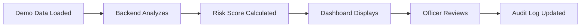

# NE-NETRA Quick Start Guide

Get NE-NETRA running in 5 minutes.

## Prerequisites

- Python 3.9+ installed
- Node.js 18+ installed
- Terminal/Command Prompt access

## Step-by-Step Instructions

### 1️⃣ Start the Backend

Open a terminal and run:

```bash
cd backend
pip install -r requirements.txt
python main.py
```

**Expected output:**
```
✓ Database initialized
✓ NE-NETRA API ready
INFO:     Uvicorn running on http://0.0.0.0:8000
```

Keep this terminal open. The backend is now running.

### 2️⃣ Load Demo Data

Open a **new terminal** and run:

```bash
cd backend
python load_demo_data.py
```

**Expected output:**
```
✓ API is running
Loading: Baseline Activity (Low Risk)...
✓ Successfully ingested 45/45 messages
✓ Analysis complete
  Risk Score: 18.4
  Risk Level: LOW
...
✓ DEMO DATA LOADED SUCCESSFULLY
```

This creates synthetic data for 4 districts.

### 3️⃣ Start the Frontend

Open a **third terminal** and run:

```bash
npm install
npm run dev
```

**Expected output:**
```
VITE v5.x.x  ready in xxx ms

➜  Local:   http://localhost:5173/
```

### 4️⃣ Access the Dashboard

1. Open your browser
2. Go to: **http://localhost:5173**
3. You should see the NE-NETRA dashboard

## What You Should See

### Dashboard Features:

1. **Header**
   - District selector dropdown (try different districts)
   - Live system time

2. **Risk Score Card**
   - Large composite score (0-100)
   - Risk level badge (Low/Medium/High/Critical)
   - Trend indicator (Rising/Stable/Falling)

3. **Risk Explanation Panel**
   - Primary trigger (main risk driver)
   - Contributing factors with severity levels

4. **Geographic Risk View**
   - District map placeholder
   - Active hotspots list

5. **Suggested Actions**
   - AI-generated recommendations
   - Labeled "Decision Support Only"

6. **Officer Review Panel**
   - Checkbox for review confirmation
   - Notes text area
   - Audit log showing previous reviews

7. **Compliance Footer**
   - "Decision Support Only - No Automated Enforcement"
   - "DPDP Act 2023 Aligned"
   - "Public / Synthetic Data Only"

## Try It Out

### Switch Districts
Click the district dropdown in the header and select different districts:
- **Kamrup Metropolitan**: Low risk baseline
- **Dibrugarh**: Medium risk with tension
- **Tinsukia**: High risk with escalation pattern
- **Jorhat**: High risk escalation detected

### Submit a Review
1. Fill in officer name (e.g., "K. Sharma")
2. Select rank (SP, DSP, DM, ADM)
3. Check "Reviewed by Authorized Officer"
4. Add notes (e.g., "Reviewed current assessment. Will monitor situation.")
5. Click "Submit Review"
6. See your review appear in the audit log below

### Explore the API
Visit: **http://localhost:8000/docs**

This shows interactive API documentation where you can test all endpoints.

## Common Issues

### "Backend API not available"
- Make sure the backend terminal is still running
- Check that it says "Uvicorn running on http://0.0.0.0:8000"
- Try visiting http://localhost:8000 directly - you should see:
  ```json
  {"status": "operational", "service": "NE-NETRA Early Warning Platform"}
  ```

### "No districts with data found"
- Run the demo data loader: `cd backend && python load_demo_data.py`
- Wait for it to complete successfully
- Refresh your browser

### Port already in use
- Backend (8000): Another app is using this port. Stop it or change the port in `main.py`
- Frontend (5173): Another Vite app is running. Stop it or it will use port 5174 automatically

## Next Steps

1. **Explore the AI Logic**: Check `/backend/intelligence.py` to see how risk scores are calculated
2. **Review the Data**: Look at `/backend/sample_data.py` to understand the synthetic scenarios
3. **Read the Full README**: See `/README.md` for comprehensive documentation
4. **Test the API**: Use the API docs at http://localhost:8000/docs

## Demo Scenarios Explained

### Kamrup Metropolitan (Low Risk: 10-25)
- Normal day-to-day activity
- Routine complaints and updates
- Low toxicity, low velocity
- **Use case**: Baseline monitoring

### Dibrugarh (Medium Risk: 30-50)
- Increased protests and complaints
- Elevated tension indicators
- Medium toxicity, moderate velocity
- **Use case**: Watch closely, brief officers

### Tinsukia (High Risk: 60-75)
- Gradual escalation over 3 days
- Mix of normal → tension → high risk messages
- High toxicity, high velocity
- **Use case**: Increased patrol, monitor closely

### Jorhat (High Risk: 55-75)
- Escalatory messaging detected
- Coordinated activity patterns
- High toxicity, inflammatory language
- **Use case**: Immediate review, consider preventive measures

## What Happens When You Run This?



1. **Synthetic messages** are ingested into the database
2. **AI analyzes** sentiment, toxicity, velocity, geo-sensitivity
3. **Risk score** is calculated using transparent formula
4. **Dashboard shows** explainable results
5. **Officer reviews** and makes decisions
6. **Audit log** maintains complete accountability

## Architecture Overview

```
Frontend (React)  →  Backend (FastAPI)  →  Database (SQLite)
     ↓                      ↓                      ↓
   Dashboard         AI Intelligence         Messages
   Components        Engine                  Risk Scores
                     - Sentiment             Officer Reviews
                     - Toxicity              Audit Logs
                     - Velocity
                     - Geo-weighting
```

## Understanding the Risk Score

The composite risk score (0-100) is calculated using:

```
Risk Score = (
    Sentiment Component    × 25% +
    Toxicity Component     × 35% +
    Velocity Component     × 25% +
    Geo-Sensitivity Comp   × 15%
) × 100
```

**All components are transparent and explainable:**
- Click on a district to see the full breakdown
- Each contributing factor shows severity and value
- Primary trigger identifies the main risk driver

## Need Help?

- **Backend issues**: Check terminal running `python main.py`
- **Frontend issues**: Check browser console (F12)
- **Database issues**: Delete `backend/ne_netra.db` and restart
- **API questions**: Visit http://localhost:8000/docs

---

**You're ready to explore NE-NETRA!** 🚀

This is a working prototype demonstrating:
✅ Explainable AI risk scoring
✅ Human-in-the-loop workflow
✅ Complete audit trail
✅ DPDP-compliant architecture

Perfect for evaluating a 6-week controlled pilot in 2 districts.
